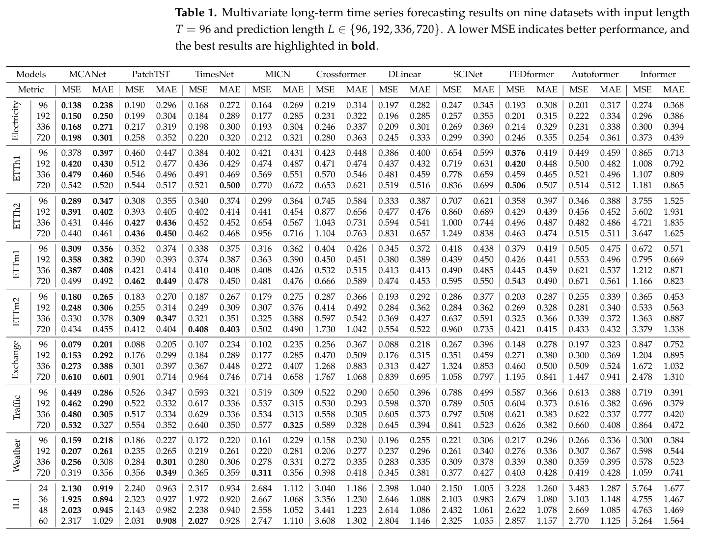
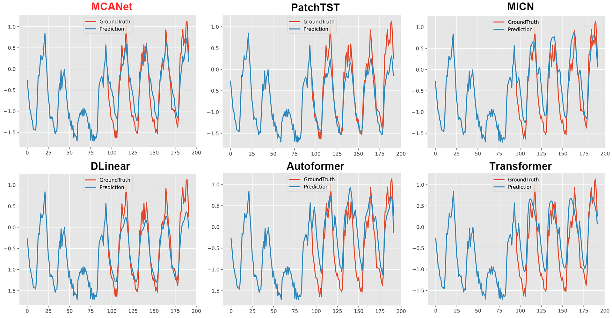
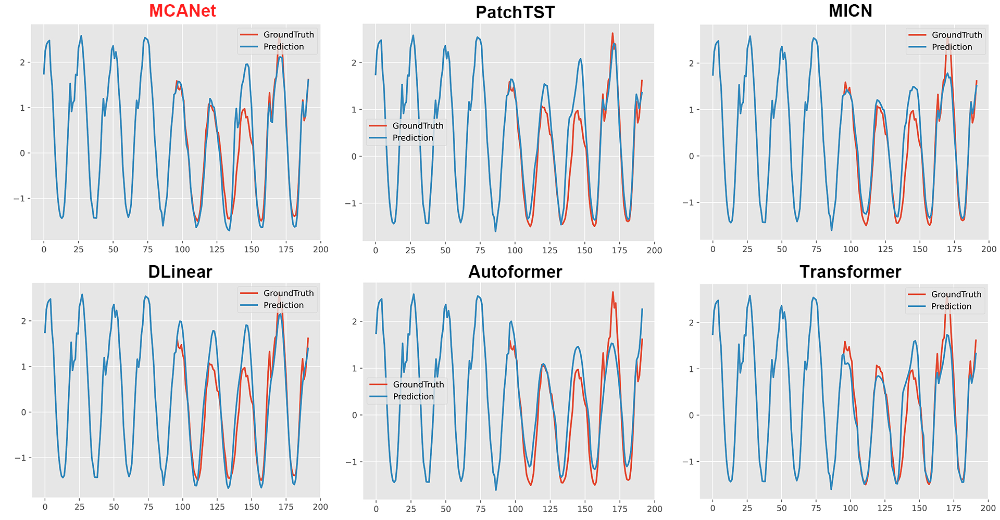
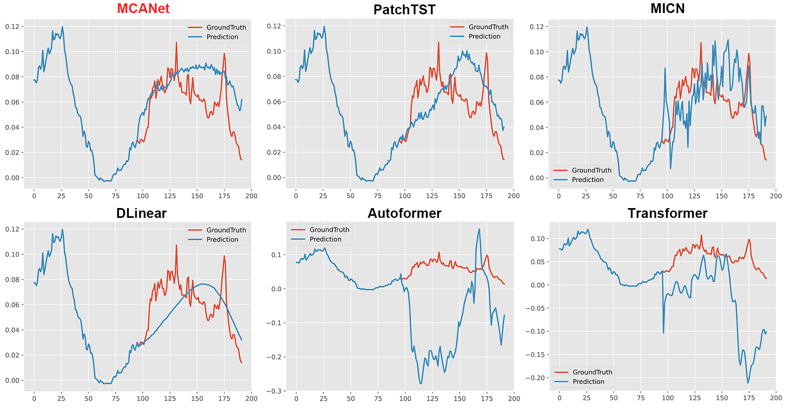

# MCANet: Multi-scale Context Aggregation Modeling for Long-term Series Forecasting
Code release of paper “MCANet: Multi-scale Context Aggregation Modeling for Long-term Series Forecasting” MCANet achieve SOTA on six benchmarks.

##  Overall Architecture
<p align="center">

<br><br>
</p>


### MCA block
<p align="center">

<br><br>
</p>


## Get Started

1. `pip install -r requirements.txt`

2. Data. All the six benchmark datasets can be obtained from [Google Drive](https://drive.google.com/file/d/1CC4ZrUD4EKncndzgy5PSTzOPSqcuyqqj/view?usp=sharing) or [Tsinghua Cloud](https://cloud.tsinghua.edu.cn/f/b8f4a78a39874ac9893e/?dl=1).

3. Reproducibility. We provide the experiment scripts of all benchmarks under the folder `./scripts`. You can reproduce the experiments results by:

```
bash ./scripts/ETTm.sh
bash ./scripts/ETTh.sh
bash ./scripts/ECL.sh
bash ./scripts/Exchange.sh
bash ./scripts/Traffic.sh
bash ./scripts/WTH.sh
bash ./scripts/ILI.sh
```

## Experiments
### Main Results



### Visualization
Visualization of forecasting results: The forecasting results from the test set of multivariate datasets, Electricity , Traffic and Weather, are visualized in Figure.1 , Figure.2 and Figure.3.



Figure 1: Multivariate forecasting cases using the Electricity dataset with model MCANet and other models. Input-length = 96, Prediction-length = 96.



Figure 2: Multivariate forecasting cases using the Traffic dataset with model MCANet and other models. Input-length = 96, Prediction-length = 96.



Figure 3: Multivariate forecasting cases using the Weather dataset with model MCANet and other models. Input-length = 96, Prediction-length = 96.


## Contact
If you have any questions, please contact hongbowang@mail.gufe.edu.cn. Welcome to discuss together.


## Acknowledgement

We appreciate the following github repos a lot for their valuable code base or datasets:

https://github.com/thuml/Time-Series-Library

https://github.com/wanghq21/MICN

https://github.com/laiguokun/multivariate-time-series-data
